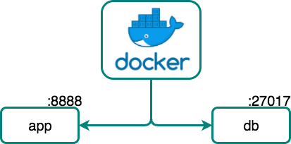
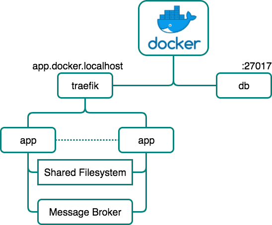
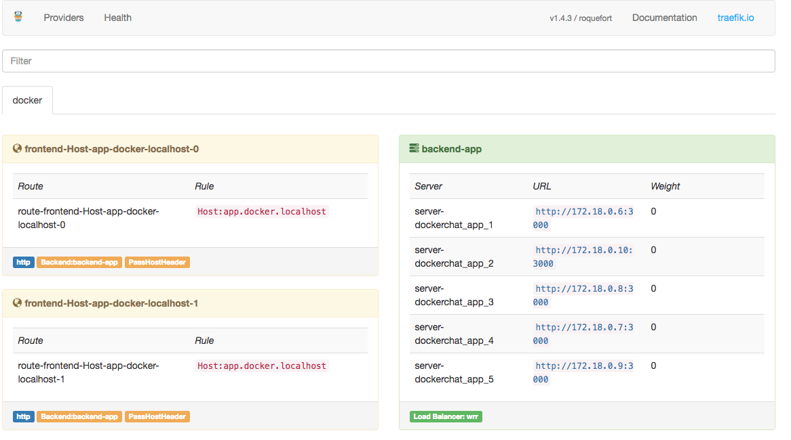
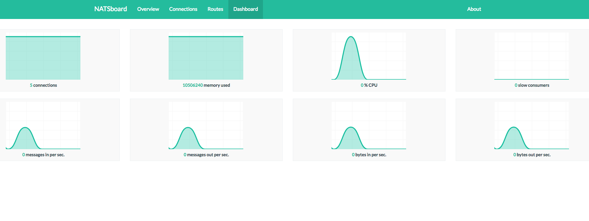

# docker-chat

Dockerized chat, based on my previous project [SocketIOChatDemo], which is an example of a web application using *socket.io* library.

This repository is a perfect example for a dockerized application having multiple services like a Database and a Backend. I personally use this project in demos for different technologies like [Kubernetes] or [Docker].

This project tries to follow a [Microservices architecture] where either in the [basic](#basic) setup nor the [advanced](#advanced)  consist on multiple services that run in separate containers


- [Features](#features)
- [Demo](#demo)
- [Basic Setup](#basic)
    - [Services](#b-services)
    - [Usage with git](#b-git)
    - [Usage with Docker Hub](#b-hub)
- [Advanced Setup](#advanced)
    - [Services](#a-services)
    - [Deployment with docker-compose](#dep_docker)
    - [Deployment with Kubernetes](#dep_k8s)
- [Resources](#resources)


<a name='features'></a>

## Features

In order to provide a realistic demo this applications has the following features:

+  __Database Perssistance:__ all messages and users are stored perssistently in a database.

+ __Session Management:__ whenever te name is introduced, a session is created and managed using NodeJS module [Express Session]. Aditionally, in order to have persistent sessions while scalling our services, sessions are stored in the database using [MongoStore].
+ __Websocket Support:__ being a chat application it's needed some kind of real time comunication between the clients and the server, for this [SocketIO] is used as [WebSocket] library. When scalling services using WebSockets there are 2 things to take care of;
    + `Session affinity`: in order to stablish the [WebSocket handshake] between the client and one of the replicas.
    + `Message replication`: once the hanndshake is stablished, messages need to be replicated through al replicas usinga  queue that comunicates all of them.

IMAGE WEBSOCKET

+ __Storage Management:__  users can upload a profile photo, this implies handling file uploads and storage management. When scalling services, storage management becomes more complicated because all replicas need to access the same filesystem. This will be solved in 2 ways:
    + Local volume: when using `docker-compose` in a local enviroment this can be solved by creating a shared Docker `volume` between replicas.
    + Distributed filesystem: when deploying the application in a real-life enviroment, replicas will be distributed son sharing a local volume becomes impossible. For this, [Distributed Filesystems] are the best solution, in this example it will be used [GlusterFS].

IMAGE STORAGE
<a name='demo'></a>

## Demo

This a basic demo of the chat working


<a name='basic'></a>

## Basic Setup
The basic setup adds to the [SocketIOChatDemo] a database where all mesages will be stored. Using this setup it is assumed that no service will be repplicated. The resulting system has the following modules and is described in the `docker-compose.yaml`.

<a name='b-services'></a>

### Services


+ __Web (app):__ [NodeJS] server containin all business logic and that [features](#features)  mentioned above. It uses the official [NodeJS image] as base image.
+ __Database (db):__ [MongoDB] database. It uses the official [MongoDB image] with an additional startup script which sets up users in order to have a securized database (using `MONGO_DB_APP_PASSWORD`, `MONGO_DB_APP_USERNAME`, `MONGO_DB_APP_DATABASE` enviroment variables).

<a name='b-git'></a>

### Usage with git

```bash
$ git clone https://github.com/ageapps/docker-chat
$ cd docker-chat
$ docker-compose up
# connect in your browser to <host IP>:8888
```
<a name='b-hub'></a>

### Usage with Docker Hub

```bash
# run mongo service
$ docker run -v "$(pwd)"/database:/data --name mongo_chat_db -d mongo mongod --smallfiles
# run docker-chat image
$ docker run -d --name node_chat_server -v "$(pwd)"/database:/data --link mongo_chat_db:db -p 8080:4000 ageapps/docker-chat
# connect in your browser to <host IP>:8888
```

<a name='advanced'></a>


## Advanced Setup
The advanced setup tries to set up the appplication in a real deployment scenario. This deployment will be distributed and aims to reach a high availability system. All of this means that the architecture and setup will be more complex than the [basic](#basic) one. For advanced setup, the enviroment variable `SCALABLE` needs to be set to `true`.

In order to deploy a container based system into a distributed system there will be used 2 deployment options.

+ [Using docker-compose](#dep_docker): any service can be scalled easilly and it is navively supported by Docker.
+ [Using Kubernetes](#dep_k8s): K8s is currently one of the most used container orchestration tool. This is due to its versatility and high performance.

<a name='a-services'></a>

### Services


+ __Web (app):__ [NodeJS] server containin all business logic and that [features](#features)  mentioned above. It uses the official [NodeJS image] as base image.
+ __Database (db):__ [MongoDB] database. It uses the official [MongoDB image] with an additional startup script which sets up users in order to have a securized database (using `MONGO_DB_APP_PASSWORD`, `MONGO_DB_APP_USERNAME`, `MONGO_DB_APP_DATABASE` enviroment variables).

+ __Load Balancer (proxy):__ [traefik] proxy. __This service is only used when deploying with `docker-compose`__. This load balancer is needed in order to handle the service repplication and balance traffic between them aswell as session affinity for WebSocket support. It uses the official [traefik image] being the access point to the system. There is a management interface accesing `localhost` in port `8080`.


+ __Message Broker (redis/rabbit/nats):__ This service is needed in order to scale WebSockets. The application supports 3 message brokers which are attached to [SocketIO] library as adapters:
    + `Redis`: It's possible to use the [Redis]'s publish/subscribe service as message broker. For this it's used the [Redis Adapter].
        To connect to the Redis service it's needed to use the `REDIS_HOST` enviroment variable.

        __NOTE:__ Redis has an extra limitation that all messages used by the publish/subscribe service have to be strings, for this the `PARSE_MSG` enviroment variable has to be added.

    + `RabbitMQ`:  It's possible to use the [RabbitMQ] as message broker. For this it's used the [Rabbit Adapter].
        To connect to the RabbitMQ service it's needed to use the `RABBIT_HOST` enviroment variable.
        RabbitMQ has a management web interface which is accessible using `localhost` in port `15672`.
        

    + `NATS`: It's possible to use the [NATS] as message broker. For this it's used the [NATS Adapter].
        To connect to the NATS service it's needed to use the `NATS_HOST` enviroment variable.
        There is a NATS dashboard which can be accessed using `localhost` in port `3000`.

        

<a name='dep_docker'></a>

### Deployment with docker-compose
In order to deploy the system with `docker-compose` it's needed an additional configuration. [traefik] proxy needs to use a DNS name in order to provide session affinity. For this, the DNS name chosen is `app.docker.localhost`, and it has to be added into the `/etc/hosts` file:

```bash
...
127.0.0.1  app.docker.localhost
...
```
Download the source code:
```bash
$ git clone https://github.com/ageapps/docker-chat
$ cd docker-chat
```
Deploy with any of the configurations proposed
```bash
# Redis configuration
$ docker-compose -f docker-compose.redis.yaml up
# Rabbit configuration
$ docker-compose -f docker-compose.rabbit.yaml up
# Nats configuration
$ docker-compose -f docker-compose.nats.yaml up
# connect in your browser to app.docker.localhost
# connect in your browser to <host IP>:8888 for the configuration pannel
```
Scale the app service
```bash
# Redis configuration
$ docker-compose -f docker-compose.redis.yaml scale app=5
# Rabbit configuration
$ docker-compose -f docker-compose.rabbit.yaml scale app=5
# Nats configuration
$ docker-compose -f docker-compose.nats.yaml scale app=5
```
<a name='dep_k8s'></a>

### Deployment with Kubernetes
Once `kubectl` is set up and connected to your cluster, the following steps should be followed in order to deploy the application:

#### Global configurations
There are global configurations needed for deployment, like database credentials.
```bash
$ kubectl apply -f k8s/global-config.yaml
```
#### Services
These include the rest of the services used in the system.

Before deploying any service it's needed to choose a message broker, once this is done, it's necessary to configure it in the `k8s/docker-chat/docker-chat.yaml` file by un commenting the configuration needed for each message broker.
```yaml
###### MESSAGE BROKERS ########
        # # REDIS
        # - name: REDIS_HOST
        #   valueFrom:
        #     configMapKeyRef:
        #       name: global-config
        #       key: app.redis_host
        # RABBIT
        - name: RABBIT_HOST
          valueFrom:
            configMapKeyRef:
              name: global-config
              key: app.rabbit_host
        # # NATS
        # - name: NATS_HOST
        #   valueFrom:
        #     configMapKeyRef:
        #       name: global-config
        #       key: app.nats_host
```

```bash
$ kubectl apply -f k8s/mongo
# Depending on chosen broker
$ kubectl apply -f k8s/rabbit
$ kubectl apply -f k8s/redis
$ kubectl apply -f k8s/nats
# Main service
$ kubectl apply -f k8s/docker-chat
```

#### Ingress deployment
As mentioned in the services section, since WebSockets are used, it's needed to have session affinity in the `Load Balancer` service of our system, for this, it's proviced an example [here](./k8s/ingress) (`/k8s/ingress`) using [NGINX Ingress Controller]. You can find more information about the ingress controller and other examples of them in the [ingress documentation].

After following these instructions, the ingress has to be configured.
```bash
$ kubectl apply -f k8s/ingress/app-ingress.yaml
```
#### GlusterFS deployment
Considering a [GlusterFS] cluster is already deployed ([Here](https://github.com/GoogleCloudPlatform/compute-ansible-gluster) is a great example of how to do it) let`s mount it as a volume in our containers.
In order to use the [GlusterFS] feature there are some considerations to take care. On the first hand, the cluster ip adresses should be added into the `glusterfs/glusterfs.yaml` file.
```yaml
kind: Endpoints
apiVersion: v1
metadata:
  name: glusterfs
subsets:
  - addresses:
      - ip: XXXXX
    ports:
      - port: 1
  - addresses:
      - ip: XXXXX
    ports:
      - port: 1
```
Additionaly, the commented lines related to the volume mount of the GlusterFS system need to be uncommented:
```yaml
spec:
      # volumes:
      # - name: glusterfs-content
      #   glusterfs:
      #     endpoints: glusterfs-cluster
      #     path: kube-vol
      #     readOnly: true
      containers:
      - name: "docker-chat"
        image: "ageapps/docker-chat:app"
        imagePullPolicy: Always
        ports:
          - containerPort: 3000
        command: ["bash", "-c", "nodemon ./bin/www"]
        # volumeMounts:
        # - name: glusterfs-content
        #   mountPath: /uploads
```
Finally, update all services and deploy the needed services. There is the possibillity to test what the content inside the cluster is by deloying the `browser` service.
```bash
$ kubectl apply -f k8s/glusterfs
# Main service
$ kubectl apply -f k8s/docker-chat
# Browser service
$ kubectl apply -f k8s/browser
```
<a name='resources'></a>

## Resources
+ [Docker]: Software containerization platform
+ [SocketIOChatDemo]: Chat web application.
+ [NodeJS]: Server enviroment.
+ [MongoDB]: NoSQL database system.
+ [mongoose]: MongoDB object modeling for *node.js*.
+ [docker-build]: Automated build of *Docker* images.
+ [docker-compose]: Automated configuration and run of multi-container *Docker* applications.
+ [Kubernetes]: Open-source system for automating deployment, scaling, and management of containerized applications.


[here]: http://swarm1397.cloudhero.io:8080/
[Microservices architecture]: http://microservices.io/patterns/microservices.html
[SocketIOChatDemo]: https://github.com/ageapps/SocketIOChatDemo.git
[NodeJS image]: https://hub.docker.com/_/node/
[MongoDB image]: https://hub.docker.com/_/mongo/
[MongoDB]: https://www.mongodb.com
[mongoose]: http://mongoosejs.com/index.html
[NodeJS]: http://nodejs.org
[Docker]: https://docs.docker.com/
[docker-compose]:https://docs.docker.com/compose/compose-file/
[docker-build]:https://docs.docker.com/engine/reference/builder/
[Kubernetes]:https://kubernetes.io/
[WebSocket handshake]:https://tools.ietf.org/html/rfc6455
[WebSocket]:https://en.wikipedia.org/wiki/WebSocket
[MongoStore]:https://www.npmjs.com/package/connect-mongo
[GlusterFS]:https://www.gluster.org/
[traefik]:https://traefik.io/
[NATS]:https://nats.io/
[NATS Adapter]:https://www.npmjs.com/package/socket.io-nats
[RabbitMQ]:https://www.rabbitmq.com/
[Rabbit Adapter]:https://www.npmjs.com/package/socket.io-amqp
[Redis]:https://redis.io/
[Redis Adapter]:https://github.com/socketio/socket.io-redis
[traefik image]:https://hub.docker.com/r/_/traefik/
[SocketIO]:https://socket.io/
[Express Session]:https://github.com/expressjs/session
[NGINX Ingress Controller]: https://github.com/kubernetes/ingress-nginx
[ingress documentation]: https://github.com/kubernetes/ingress-nginx/blob/master/docs/catalog.md
